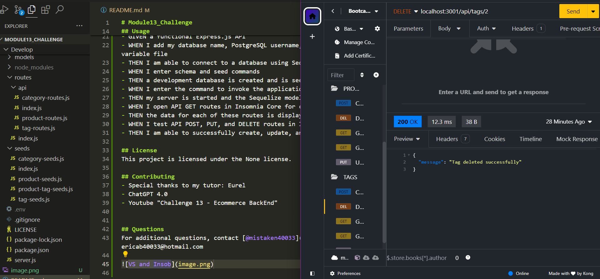

# Module13_Challenge
E-commerce

# Youtube
https://youtu.be/KPMIIoGeDNM

## Table of Contents
- [Installation](#installation)
- [Usage](#usage)
- [License](#license)
- [Contributing](#contributing)
- [Questions](#questions)

## Installation
Code Provided "starter code", on ther Terminal install  "npm i pg", "npm i", "npm i sequelize", and "npm i dotenv"

## Usage
User Story
- AS A manager at an internet retail company
- I WANT a back end for my e-commerce website that uses the latest technologies
- SO THAT my company can compete with other e-commerce companies

Acceptance Criteria
- GIVEN a functional Express.js API
- WHEN I add my database name, PostgreSQL username, and PostgreSQL password to an environment variable file
- THEN I am able to connect to a database using Sequelize
- WHEN I enter schema and seed commands
- THEN a development database is created and is seeded with test data
- WHEN I enter the command to invoke the application
- THEN my server is started and the Sequelize models are synced to the PostgreSQL database
- WHEN I open API GET routes in Insomnia Core for categories, products, or tags
- THEN the data for each of these routes is displayed in a formatted JSON
- WHEN I test API POST, PUT, and DELETE routes in Insomnia Core
- THEN I am able to successfully create, update, and delete data in my database

## License
This project is licensed under the None license.

## Contributing
- Special thanks to my tutor: Eurel
- ChatGPT 4.0
- Youtube "Challenge 13 - Ecommerce BackEnd"

## Questions
For additional questions, contact [@mistaken40033](https://github.com/mistaken40033) or email: ericab40033@hotmail.com

    